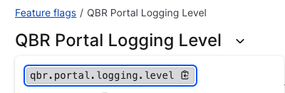
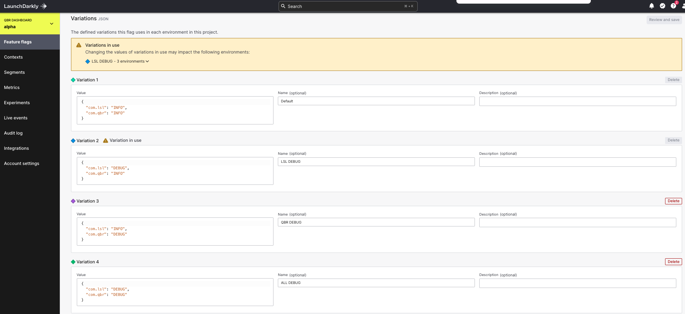

# LaunchDarklyLoggerTutorial
A simple Spring Boot application which demonstrate how LaunchDarkly pushes feature toggle change via its stream API.

## How does the demo work?
Create a Json type flag called `qbr.portal.logging.level`.




There will be the following variation:

Variation | Rules 
---------- | -----------
Default | ```{ "com.lsl": "INFO", "com.qbr": "INFO" }```
LSL DEBUG  | ```{ "com.lsl": "DEBUG", "com.qbr": "INFO" }```
QBR DEBUG | ```{ "com.lsl": "INFO", "com.qbr": "DEBUG" }```
ALL DEBUG |  ```{ "com.lsl": "DEBUG", "com.qbr": "DEBUG" }```




## How to run it
Pass LaunchDarkly API Key via environment variable `LAUNCH_DARKLY_SDK_KEY` when running the application. 

```
mvn clean package

java -DLAUNCH_DARKLY_SDK_KEY=<LAUNCH DARKLY SDK KEY> -jar target/LaunchDarklyTutorial.jar
```


